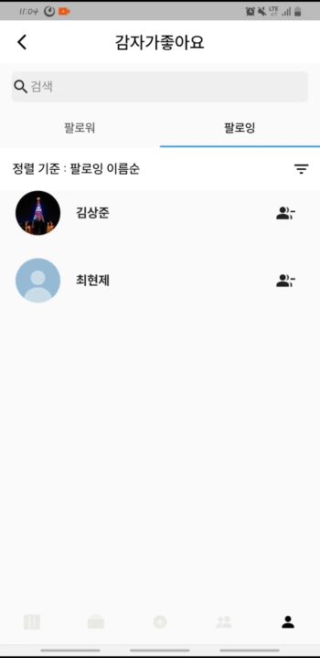

# AreaStory

**진행 기간**: 2023.4.10 ~ 2023.5.26

### 지도로 보여주는 나의 이야기 SNS 서비스

---

## 팀원 소개

## **개발 환경 및 IDE**

**Frontend**

- 언어: Dart
- 프레임워크: Flutter
- IDE: Android Studio

**Backend**

- 언어: Java, SQL
- 프레임워크: IntelliJ, MySQL
  Java, Spring WebSocket, Spring Boot, Spring Data JPA, Gradle, IntelliJ IDEA, Redis, MySQL, OAuth 2.0 & Kakao Login

**Server**

- Amazon EC2, Jenkins, Nginx, Docker

**Cooperation & Communication**

- Gitlab, Jira, Mattermost, Notion, Figma

## **기획 배경**

- 지역별, 당일의 핫한 이슈를 공유하고 나만의 지도를 만들고 싶다.
- 일반 SNS을 벗어나 현재 위치를 기반으로 한 SNS를 만들어보고 싶다.
- 내가 원하는 지역의 글들만 볼 수 있는 SNS를 만들어보고 싶다.

## **주요 기능**

### 1. 지도

- 확대, 축소, 본인위치 이동
  
  - 지도에서 확대 및 축소에 따라 도,시/ 시,군,구/ 동,읍,면 총 3개의 행정 구역단위로 해당 구역의 각 하위 행정구역 게시글중 가장 좋아요가 많은 게시글을 지도에 보여줍니다.

  

  - 지도에서 다른 지역을 살펴보고있어도 좌측 하단에 존재하는 버튼을 터치하면, 현재 내 위치로 이동합니다.

  

- 지도 게시글 카드 -지도에 보여지는 사진을 터치하면 게시글 카드가 모달로 보여집니다. 해당 카드를 통해서 지역의 게시글 목록으로 이동이 가능합니다.

  

   

### 2. SNS

- 검색, 현재 위치 이동
  
  - 검색창에 자동 완성 기능으로, 내용을 입력 할 수 있습니다. 장소를 입력하게 되면, 해당 지역의 SNS로 이동하게 됩니다.
  - 상단에 현재 위치 이동 버튼이 존재하며 누르면 위치기반으로 현재 위치의 SNS로 이동합니다.

  

- 지역 실시간 채팅
  
  - SNS페이지에서 현재 위치의 실시간 채팅방을 들어갈 수 있습니다. 같은 위치의 사람들과 소통합니다.

  

- 정렬
  
  - 게시글과 댓글에 인기순, 최신순이 존재합니다.

  
- 게시글 관련 CRUD (게시글 CUD / 댓글 CUD / 좋아요 CD / 팔로우 CD)
  
  - 일반 SNS와 같이 기본 CRUD 제공합니다.
    
     

### 3. 게시글 생성

- 게시글 생성
  
  - 사진을 찍으면 현재 위치가 찍히고, 공개/비공개 버튼이 존재하며 비공개로 한다면 나만 볼수 있습니다.

  
    
   

### 4. 팔로우 SNS

- 팔로잉의 프로필 이미지
  
  - 나의 팔로잉 들만 보여주는 SNS 페이지이며, 팔로잉들의 프로필을 드래그로 한눈에 볼 수 있고, 누르면 해당 유저 마이페이지로 이동합니다.
  
  - 지역 SNS와 디자인은 동일합니다.

  
     

### 5. 마이페이지

- 프로필수정
  
  - 프로필 이미지 선택시 프로필 수정페이지로 이동합니다.
  - 기기의 앨범에서 이미지 선택이 가능하며 닉네임 수정이 가능합니다.

  

- 팔로워/ 팔로잉 목록
  
  - 팔로워, 팔로잉 수를 선택하면 팔로워/ 팔로잉 목록으로 이동
  - 최신순, 오래된순, 이름순으로 정렬하여 제공할 수 있다.
  - 팔로워, 팔로잉 신청 및 취소

  

- 유저검색

  - 팔로워/ 팔로잉 목록에서 검색창을 터치하면 유저검색 페이지로 이동
  - 검색시 팔로잉 유저, 전체 유저 순으로 결과를 제공한다.

  

- 마이앨범
  
  - 내 게시글의 이미지의 저화질 버전인 썸네일을 그리드뷰 형식으로 제공
  - 내 게시글 이미지 선택시, 게시글 디테일 페이지로 이동
  
  

- 내지도
  
  - 내 게시글로 채워진 지도 제공

  

- 옵션
  
  - 유저신고: 다른 유저의 마이페이지 접속시, 유저신고 기능 활성화

  

  - 로그아웃: 앱종료
  
  - 회원탈퇴: 본인의 마이페이지 접속시, 회원탈퇴 기능 활성화
    
     

## ERD

- location ERD

  

- Article ERD

  

- User ERD

  

## 시스템 아키텍쳐

